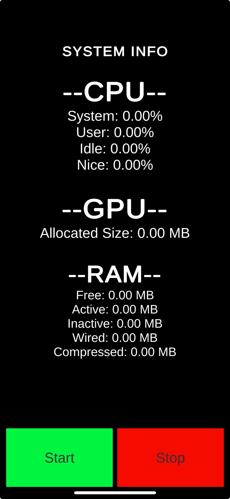

# Unity Native iOS Usage Tracker

This is the project created for Unity 3D Mobile SDK Engineer Prescreen at Yodo1.

## Description
 - Developed with Unity 2022.3.22f1, XCode 15.3
 - Tested on iPhone 13 Pro(17.3.1)

## Usage
1. Clone the repository
    ```bash
    git clone git@github.com:stanleychy/Yodo1IOSMonitor.git
    ```

2. Open the project in Unity, switch to the iOS platform
3. Build the proejct from Unity
4. In the build output folder, open `Unity-iPhone.xcodeproj` with XCode
5. Build and Run the app on an iOS device

## UI

- Press "Start" button to start live update of usage data in every 1 second
- Press "Stop" button to stop the live update process

